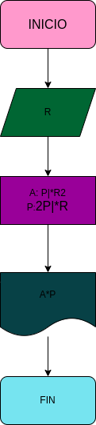

# ejercicio no.1

## calcular el area y el perimetro de un circulo de radio R

# ANALISIS

Variable de entrada (imput)

R: Radio del circulo

Variable del proceso y salida ( processing, storange, output)

A:  Area del circulo
P:  Perimetro del circulo

# DISEÑO

# CONSTRUCCION
